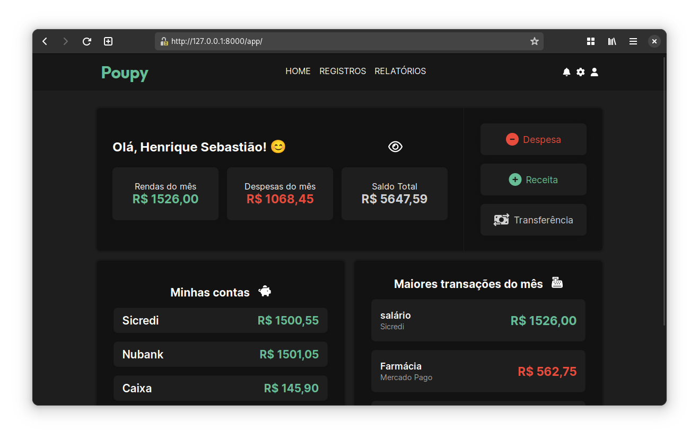

### Manage your personal budget.

Poupy is a webapp that allows you to create and manage your own personal budget.
It is a simple and intuitive application that allows you to manage your expenses and income, and also allows you to
create your own categories and subcategories.

## License

This project is licensed under the MIT License - see the [LICENSE](LICENSE) file for details.

